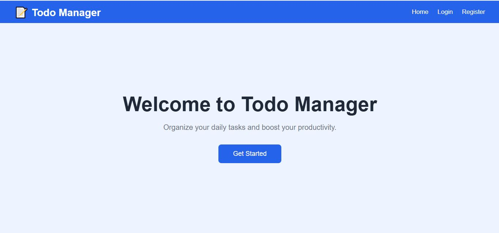
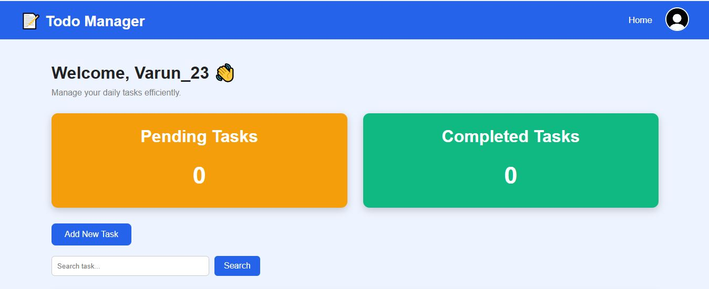
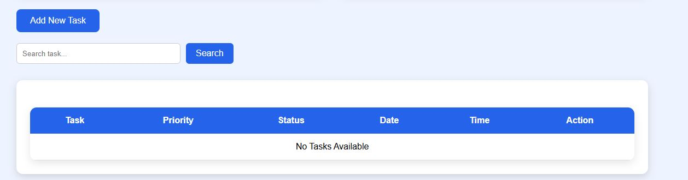
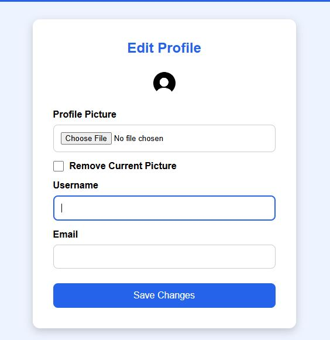

# Todo Manager Web Application

A full-stack Todo Manager web application built using Django that helps users efficiently manage their daily tasks with authentication, reminders, profile management, and task tracking.


##  Features
- User Registration & Login
- Secure Authentication
- Edit User Profile
- Upload / Remove Profile Picture
- Add New Tasks
- Edit Existing Tasks
- Mark Tasks as Completed
- Delete Tasks
- Search Tasks
- Filter Pending & Completed Tasks
- Browser Reminder Notifications
- Responsive User Interface

---

##  Technologies Used

- Python
- Django
- HTML5
- CSS3
- JavaScript
- SQLite3

---

##  Project Structure

```
Todo-Manager-Django/
│── config/
│── todo/
│── templates/
│── static/
│── media/
│── manage.py
│── requirements.txt
│── README.md
```

---

## Installation

### Clone the repository

```bash
git clone https://github.com//Smart-Todo-Manager.git
```

### Move into the project folder

```bash
cd Todo-Manager-Django
```

### Create a virtual environment

```bash
python -m venv venv
```

### Activate the virtual environment

**Windows**

```bash
venv\Scripts\activate
```

### Install dependencies

```bash
pip install -r requirements.txt
```

### Apply migrations

```bash
python manage.py migrate
```

### Run the development server

```bash
python manage.py runserver
```

Open your browser and visit:

```
http://127.0.0.1:8000/
```

---

## Screenshots

### Home Page



### Dashboard




### Add Task



### Edit Profile




## Future Improvements

- Email Reminder Notifications
- Task Categories
- Calendar View
- Export Tasks to PDF/Excel
- Dark Mode

---

##  Author

**Varun Padala**

GitHub: https://github.com/Varun-2323

LinkedIn: https://www.linkedin.com/in/varun-padala-9b7a3430a/

---
